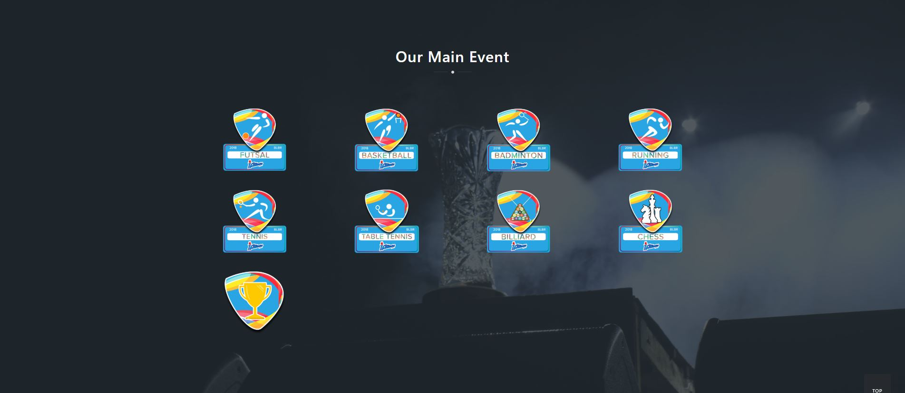
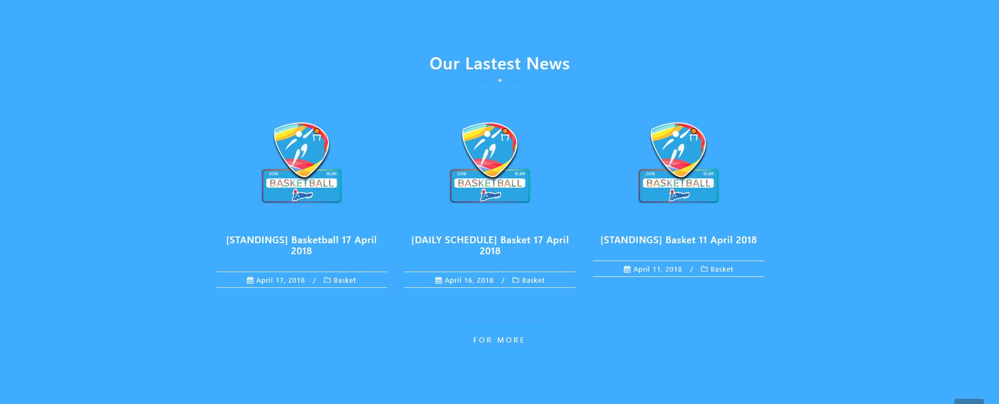

This is the data of website of Olimpiade Telkom University. Used to hosted on olimpiade.telkomuniversity.ac.id but it's already expired.
Using wordpress because the websites under telkomuniversity.ac.id domain using wordpress for the services

How to use :
1. Install the wordpress on localhost (I'm using xampp for the localhost & database)
2. Install & activate [All in one WP migration](https://wordpress.org/plugins/all-in-one-wp-migration/) plugin
3. Extract the .rar
4. Choose import in the all in one WP migration plugin, then before upload the .wpress file, set the maximum upload size to more than 350MB
5. Upload the .wpress file
7. Voila, done

Here the of screenshot of the site :

Using [Astrid Wordpress Theme](https://athemes.com/theme/astrid/), and modified by me
